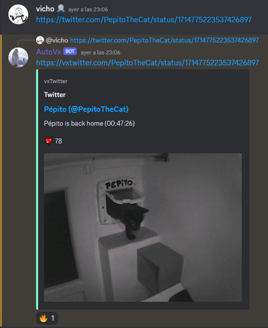

# AutoVx
AutoVx is a simple discord bot that takes your twitter (or X) sent urls and replies to your message with the url replaced with vxtwitter,
this allows you to show embedded media content from these tweets easily to your friends
# How to use
Just make a discord app on discord developers portal and paste your app token on the ``config.json`` file, then run the bot using ``python .\bot.py`` in terminal.
Remember to enable privileged gateway intent for message content as the bot uses it.

# More info
Read more about vxtwitter and how it works [here](https://github.com/dylanpdx/BetterTwitFix)

